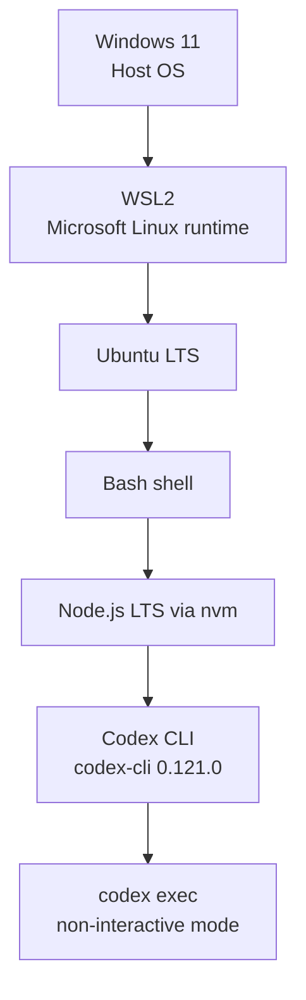
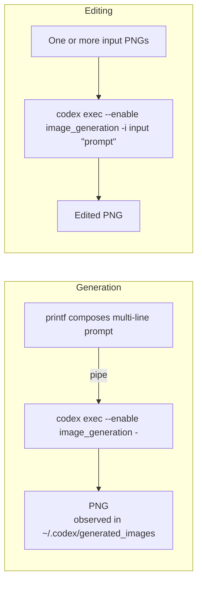
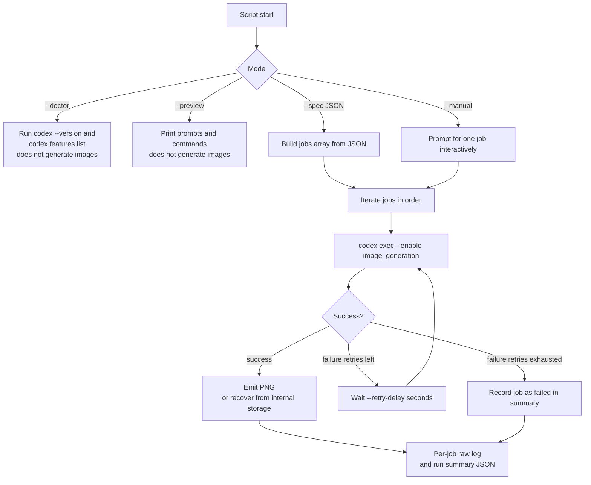
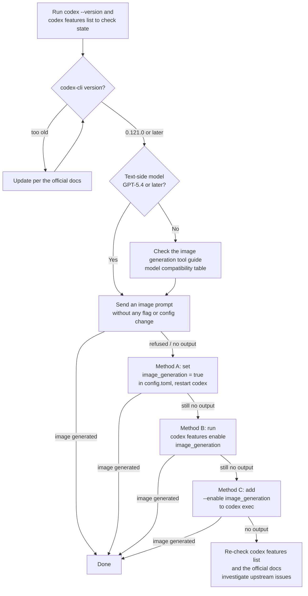

# Codex CLI Image Generation from WSL2 Ubuntu — Personal Notes (as of 2026-04-18)

This is the memo I kept while TK2Works and Codex were checking whether
`codex` could really be driven for image generation and editing from a
WSL2 Ubuntu Bash shell on Windows 11. Output did come through, so the
private notes I was keeping for myself have been tidied up and shared
here for anyone curious about the same question.

The document walks, in the order I ran them, through the smallest
working commands, whether Japanese and English prompts both went
through, which aspect ratios produced output, how `image_generation`
looked on first install, and where a small JSON-driven helper script
started to earn its keep.

## Scope of this repository

This repository is a personal technical note about testing Codex CLI image generation and image editing from a Windows 11 + WSL2 Ubuntu + Bash environment.

It is not an official guide and does not guarantee reproducibility. It records what worked in this specific environment at the time of testing.

Where possible, the notes distinguish between:

- Officially documented: behavior or options confirmed in official documentation
- Confirmed in this environment: behavior that was tested and worked in this specific setup
- Inferred: behavior inferred from test results and subject to change in future versions

> This is a personal memo captured on 2026-04-18 by one person plus
> Codex. It is not a recommendation of the exact commands or steps.
> Codex CLI evolves quickly; future releases, behavior changes, new
> findings, or official announcements may render parts of this report
> outdated or incorrect. **Treat it as a single reference point in
> time.** I may not be able to respond to questions or diffs about
> this snapshot in a timely manner, so please verify against upstream
> documentation and feel free to explore better commands, flags, and
> tooling on your side — that exploration is the intended spirit of
> this share.

**Date of observation:** 2026-04-18
**Observers:** TK2Works and Codex (on the CLI side)
**Host OS:** Windows 11
**Runtime:** Ubuntu on WSL2
**Shell:** Bash (native Windows PowerShell execution is out of scope)
**Codex CLI:** `codex-cli 0.121.0`

For the other packages, runtimes, and libraries, see the
[Environment versions and how to check them](#environment-versions-and-how-to-check-them)
section below.

One practical note before you start: commands using relative paths such
as `./examples/...` and `./codex-image-batch.sh` assume you have already
changed into the root directory of this repository. If you run them from
somewhere else, file lookups will fail.

---

## Contents

1. [Prerequisites — just the minimum](#prerequisites--just-the-minimum)
2. [30-second summary](#30-second-summary)
3. [The stack and flow at a glance (diagrams)](#the-stack-and-flow-at-a-glance-diagrams)
4. [Environment versions and how to check them](#environment-versions-and-how-to-check-them)
5. [Scope and what is not asserted](#scope-and-what-is-not-asserted)
6. [`image_generation` looked disabled by default — what held up after re-testing](#image_generation-looked-disabled-by-default--what-held-up-after-re-testing)
7. [The smallest commands that worked in this run](#the-smallest-commands-that-worked-in-this-run)
8. [Why the commands use `printf`](#why-the-commands-use-printf)
9. [Japanese and English prompts](#japanese-and-english-prompts)
10. [Aspect ratios in practice](#aspect-ratios-in-practice)
11. [From one image to many — the small helper script I wrote](#from-one-image-to-many--the-small-helper-script-i-wrote)
12. [doctor → preview → run (the order I used)](#doctor--preview--run-the-order-i-used)
13. [JSON spec shape](#json-spec-shape)
14. [Built-in presets](#built-in-presets)
15. [What this repository set out to verify, and what the results showed](#what-this-repository-set-out-to-verify-and-what-the-results-showed)
16. [Before you share the output](#before-you-share-the-output)
17. [Copy-paste command sheet](#copy-paste-command-sheet)
18. [Option cheat sheet](#option-cheat-sheet)
19. [My own small mistakes, shared as-is](#my-own-small-mistakes-shared-as-is)
20. [A note for readers new to the tooling](#a-note-for-readers-new-to-the-tooling)
21. [Official references used](#official-references-used)

---

## Prerequisites — just the minimum

This report is written for readers with minimum familiarity with Codex
CLI and WSL2, attempting to reproduce the observations below. It is
not an introductory tutorial; the upstream projects document their
own installation procedures far better than a short restatement here.

- **Codex CLI** — OpenAI's command-line tool. The commands in this
  document center on `codex exec`.
  Reference: https://developers.openai.com/codex/cli
- **WSL2** — Microsoft's supported way to run Linux on Windows. This
  report ran inside WSL2 Ubuntu with Bash.
  Reference: https://learn.microsoft.com/windows/wsl/install
- **PowerShell and Bash are different shells** — escaping and pipe
  semantics differ. The commands below assume Bash inside WSL. Native
  Windows PowerShell behavior is out of scope for this report.
- **Reading the commands** — code blocks are shown without a leading
  `$` or shell prompt, so they can be copied as-is into the Bash
  terminal.
- **Assumed state** — `codex` is already installed inside the WSL2
  Ubuntu environment, and the one-time login and sandbox setup have
  been completed.
- **Side effects** — commands in this document are ordered from lowest
  side effect to highest. `--doctor` runs `codex --version` and
  `codex features list` for diagnostics but does not generate images.
  `--preview` only prints the final prompt and the command that would
  run; it does not generate images either. Both are read-only checks.

From here on, the document records commands that were actually run and
what was observed when they were run. Comparing your own run against
the same commands is where the report earns its usefulness.

---

## 30-second summary: what worked in this environment

> This is the shortest summary of what worked in this specific Windows 11 + WSL2 Ubuntu + Bash test environment.

- Image generation and editing both worked from a Bash shell inside WSL2
  Ubuntu using `codex exec`.
- The smallest working generation call is a single line with
  `printf ... | codex exec -`.
- Editing is one line: `codex exec -i ./input.png "..."`. Two reference
  images use two `-i` flags.
- Japanese and English prompts both worked, for both generation and
  editing.
- Output sizes observed here fell into three concrete values:
  **`1024x1024`**, **`1024x1536`**, **`1536x1024`**. Arbitrary ratios
  are requests to the model, not guarantees.
- A small helper script for JSON-driven batching started to earn its
  keep once the workflow moved from one image to several.
- The Codex CLI docs explicitly state the CLI supports image generation
  and editing ([reference](#official-references-used)).

Note: In this environment, `image_generation` appeared not to be enabled by default.
This behavior may change depending on the Codex CLI version or future updates.

### Command that worked in this environment

```bash
codex exec --enable image_generation "Portrait of a cat"
```

In this environment, the command above successfully produced an image. Portrait (9:16), landscape (16:9), and square (1:1) outputs also worked in the same test environment.

### Enabling the feature persistently

In this environment, adding the following to `~/.codex/config.toml` allowed image generation to run without passing `--enable image_generation` every time.

```toml
[features]
image_generation = true
```

This is a behavior confirmed in this test environment. Required settings or behavior may change in future Codex CLI versions.

### Where the PNGs landed

In this environment, the generated PNGs were stored under:

```text
~/.codex/generated_images/<session-id>/
```

rather than the working directory expected by the prompt or helper script.

For that reason, the helper script includes a recovery step that copies generated images from the corresponding Codex generated-images session directory. See [docs/RETEST-2026-04-19.md](docs/RETEST-2026-04-19.md) for the detailed recovery notes.

## The stack and flow at a glance (diagrams)

A few quick diagrams to show how the pieces fit together. GitHub
renders Mermaid natively, so these are visible directly in the UI.

**The stack that was tested (top to bottom)**



**Minimum generation and edit command flow**



**Rough flow of the bundled `codex-image-batch.sh`**



These diagrams describe the flow used in this report and the helper
script; they do not represent the internal behavior of the Codex CLI
itself.

## Environment versions and how to check them

To keep "your mileage may vary" from being an easy excuse, here are the
versions observed during this run and the exact commands that produce
them. Values marked `—` were not captured during this report and can be
filled in by running the listed command on your machine.

| Item | This run | How to check |
| --- | --- | --- |
| Windows | Windows 11 (build `10.0.26200.8037`) | PowerShell: `winver`, or `Get-ComputerInfo \| Select-Object WindowsProductName, WindowsVersion, OsBuildNumber` |
| PowerShell | — | PowerShell: `$PSVersionTable.PSVersion` |
| WSL | `2.6.3.0` (WSLg `1.0.71`) | PowerShell: `wsl --version`, or `wsl --status` |
| Ubuntu distribution | Ubuntu `24.04.4 LTS` (Noble Numbat) | Bash: `cat /etc/os-release`, or `lsb_release -a` |
| Kernel | `6.6.87.2-microsoft-standard-WSL2` | Bash: `uname -r` |
| Bash | `5.2.21(1)-release` | Bash: `bash --version` |
| Codex CLI | `codex-cli 0.121.0` | Bash: `codex --version` |
| Codex feature state | `image_generation` enabled | Bash: `codex features list` |
| Node.js | `v24.14.1` (via nvm) | Bash: `node --version` |
| npm | `11.12.1` | Bash: `npm --version` |
| nvm | — | Bash: `nvm --version` |
| jq | `jq-1.7` | Bash: `jq --version` |
| python3 | `Python 3.12.3` | Bash: `python3 --version` |
| bubblewrap | — | Bash: `bwrap --version` |

To collect the WSL-side values in one pass, this snippet is convenient:

```bash
{
  printf '# Environment snapshot (%s)\n' "$(date -Iseconds)"
  echo "## From PowerShell, run separately:"
  echo "  winver ; Get-ComputerInfo | Select-Object WindowsProductName, WindowsVersion, OsBuildNumber ; \$PSVersionTable.PSVersion ; wsl --version"
  echo
  echo "## WSL / Bash"
  printf 'uname -a: %s\n' "$(uname -a)"
  printf 'bash: %s\n' "$BASH_VERSION"
  cat /etc/os-release 2>/dev/null | grep -E '^(NAME|VERSION)='
  printf 'codex: %s\n' "$(codex --version 2>/dev/null || echo 'not found')"
  printf 'node: %s\n' "$(node --version 2>/dev/null || echo 'not found')"
  printf 'npm: %s\n' "$(npm --version 2>/dev/null || echo 'not found')"
  printf 'jq: %s\n' "$(jq --version 2>/dev/null || echo 'not found')"
  printf 'python3: %s\n' "$(python3 --version 2>/dev/null || echo 'not found')"
  printf 'bwrap: %s\n' "$(bwrap --version 2>/dev/null || echo 'not found')"
}
```

PowerShell and Windows build numbers cannot be read from WSL directly,
so run these on the Windows side:

```powershell
Get-ComputerInfo | Select-Object WindowsProductName, WindowsVersion, OsBuildNumber
$PSVersionTable.PSVersion
```

## Scope and what is not asserted

The observations cover only the environment listed above. For anything
outside that envelope, this report stays silent rather than generalizing.

- Stable operation confirmed at `1024x1024`, `1024x1536`, and
  `1536x1024`.
- `codex exec` accepted prompts via stdin and as argument strings, for
  both generation and edit flows.
- In the 2026-04-19 re-test, generated files appeared under
  `~/.codex/generated_images/<session-id>/` rather than the
  working-directory path expected by the prompt or helper flow.
- The text-side model flow was observed as GPT-5.4-class. Which
  image-model alias the CLI selected per call was not directly
  observable from the CLI surface in this run.
- No private identifiers (character names, machine names, home paths,
  personal email, API keys, pinned Node version strings) are carried
  into this repository.

Not asserted:

- The specific image-model alias used on any given call.
- Behavior on pre-GPT-5.4 model generations.
- That arbitrary sizes such as `1408x768` are honored literally.
- Equivalent behavior on native Windows PowerShell.

## `image_generation` looked disabled by default — what held up after re-testing

On a fresh install in my environment, `codex features list` showed
`image_generation` as disabled (`false`). This is what I saw on my
machine rather than a claim about the canonical default.

### Preconditions to confirm first

Before trying to enable image generation, three things are worth
checking. With all three in place, image generation ran end-to-end in
my environment.

- **Codex CLI version.** Older `codex-cli` releases may not include
  the image-generation subcommands or the built-in tool. I tested
  `codex-cli 0.121.0`. Run `codex --version` to confirm yours.
- **Text-side model is GPT-5.4 or later.** OpenAI's
  [image generation tool guide](https://developers.openai.com/api/docs/guides/tools-image-generation)
  lists models that can drive the built-in `image_gen` tool,
  including GPT-5 / 5.2 / **5.4** / 5.4-mini / 5.4-nano. I did not
  test the same workflow on pre-5.4 models.
- **Codex login is complete.** Start `codex` once interactively to
  finish the browser authorization before anything else.

> **Cross-check (2026-04-19)**: The OpenAI Codex docs
> ([Features – Codex CLI](https://developers.openai.com/codex/cli/features)
> and [Config basics](https://developers.openai.com/codex/config-basic))
> do not list `image_generation` in their public feature tables at the
> time of writing. OpenAI's
> [image generation tool guide](https://developers.openai.com/api/docs/guides/tools-image-generation)
> notes that image generation is exposed as a built-in `image_gen`
> tool that Codex can use by default. In other words,
> **on some installations, simply prompting Codex without any flag or
> config change may be enough to trigger image generation.** Try that
> first, and only fall back to the two methods below if the call is
> refused.
>
> Separately,
> [Features – Codex CLI](https://developers.openai.com/codex/cli/features)
> documents `codex features enable <feature>` /
> `codex features disable <feature>` / `codex features list` as
> persistent management subcommands. In a fresh isolated `CODEX_HOME`,
> I verified that `codex features enable image_generation` writes
> `[features]\nimage_generation = true` to `config.toml` and flips
> `codex features list` to `true`.

Below are the three methods I confirmed working, **listed in the order I
would recommend trying them**.

### Method A (preferred): set it in `~/.codex/config.toml`

```toml
[features]
image_generation = true
```

I recommend this path first because `config.toml` is where
[Config basics](https://developers.openai.com/codex/config-basic)
places "your personal defaults." Adding a `key = true` line under
`[features]` is the documented persistent way to turn a feature on.

**After saving the file, restart `codex` if an interactive session
is already running.** The config file is read at startup, so a
running session will not pick up the change until you restart it.
For `codex exec`, a fresh process spawns each call, so the next call
sees the new config.

With those two lines in place, both the interactive `codex` and
`codex exec` produced images in my environment with no further flag.

### Method B: use the persistent feature-management command

```bash
codex features enable image_generation
```

This is Codex's own persistent path for writing the same feature flag.

### Method C: pass `--enable image_generation` on a single call

```bash
codex exec --enable image_generation -
```

Use this if you would rather not edit `config.toml`, or if you want a
one-off activation. Per the
[Codex CLI reference](https://developers.openai.com/codex/cli/reference),
`--enable` is a global flag that is internally equivalent to
`-c features.<name>=true`. The bundled `codex-image-batch.sh` only
adds this flag when `codex features list` reports the feature as
disabled (i.e., when `config.toml` has not been set).

In the 2026-04-19 re-test, this flag behaved as a practical no-op once
`image_generation = true` was already present in config.

New CLI versions may change defaults or the enablement path. On a
fresh version, check `codex --version`, `codex features list`, and
the official docs linked above before assuming the methods here
still apply.

### Decision flow — which path to try

Prose can be hard to follow when the decision has this many branches,
so here is the same logic as a flowchart.



## The smallest commands that worked in this run

Three one-liners, in the order they were run, each recorded verbatim
for reproduction. Running the same commands on your side and comparing
output is the primary intended use of this section.

The commands below include `--enable image_generation` defensively.
If you already set `image_generation = true` in `~/.codex/config.toml`
(Method A above, the path I recommend), the flag is unnecessary.
If your Codex install surfaces the built-in `image_gen` tool by
default (see the cross-check note earlier in the section), you may
not need either the flag or the config change.

**Generate one image:**

```bash
printf 'Use the built-in image generation capability only.\nGenerate a square 1:1 image of a blue sphere on a white background.\nNo text, no logo, no watermark.\n' | codex exec --enable image_generation -
```

**Edit one image:**

```bash
codex exec --enable image_generation -i ./input.png "Use the built-in image editing capability only. Change the background to white. Keep the subject, composition, and colors intact. No text, no logo, no watermark."
```

**Edit using one image as base and another as reference (treating the first as base and the second as reference):**

```bash
codex exec --enable image_generation -i ./base.png -i ./reference.png "Use the first image as the base. Transfer the palette and mood from the second image while preserving the composition and main subject of the first image. No text, no logo, no watermark."
```

> Note: The
> [Codex CLI reference](https://developers.openai.com/codex/cli/reference)
> documents `-i` / `--image` simply as "Attach images to the first
> message. Repeatable; supports comma-separated lists." **The ordering
> semantics — which image is treated as base vs. reference — are not
> defined at the CLI level.** The command above only behaves that way
> because the prompt explicitly says "Use the first image as the base.
> … palette and mood from the second image …". The mapping is driven
> by the prompt, not by the CLI flag order.

Two short sanity checks I ran before the first real call:

```bash
codex --version
codex features list
```

In this run, `codex --version` printed `codex-cli 0.121.0`, and
`codex features list` showed `image_generation` as `false` — which is
why the three commands above add `--enable image_generation`. In the
2026-04-19 re-test, `image_generation` was already `true`, and the same
image call worked both with and without `--enable`, making the flag
effectively redundant in that configuration.

## Where the PNG actually ended up in the re-test

The most important operational result from the 2026-04-19 re-test was
that Codex produced PNGs but did not place them in the requested
workdir path. Instead they appeared here:

```text
~/.codex/generated_images/<session-id>/ig_*.png
```

Use the `session id` shown at the top of the run log and copy the file
out manually:

```bash
session_id="019da255-d906-7831-8a2d-0912b86d3e00"
cp ~/.codex/generated_images/"$session_id"/*.png ./recovered-output.png
```

The same re-test showed that enabling sandbox network access with
`--full-auto -c sandbox_workspace_write.network_access=true` did not
change this storage behavior. For those observed runs, network access
was not required.

A public-safe summary of that re-test lives in
[docs/RETEST-2026-04-19.md](docs/RETEST-2026-04-19.md), and the selected
comparison images plus prompt notes live in
[examples/gallery/README.md](examples/gallery/README.md).

## Why the commands use `printf`

The one-liners use `printf` on purpose.

- `echo` interprets `\n` differently across shells and builds. `printf`
  is specified by POSIX, so multi-line prompts are portable.
- The trailing `-` in `| codex exec -` is `codex exec`'s explicit signal
  that the prompt comes from stdin. That lets you hand over multi-line
  text cleanly.

Broken down:

```bash
printf 'line1\nline2\nline3\n' | codex exec -
#  ^^^^^^                      ^     ^^^^^^^^^^
#  print multiple lines         pipe   read prompt from stdin
#  with real newlines
```

A form without `-i ./input.png` (the generation example) means "no
attached image, generate from scratch." Adding `-i` switches the call
into edit mode on that attached image.

For longer prompts, a heredoc is equally valid:

```bash
codex exec - <<'EOS'
Use the built-in image generation capability only.
Generate a square 1:1 image of a blue sphere on a white background.
No text, no logo, no watermark.
EOS
```

The single quotes around `'EOS'` disable shell variable expansion and
history expansion inside the prompt body. That matters when the prompt
contains `$`, backticks, or `!`.

## Japanese and English prompts

Both languages worked in practice. All four combinations are covered:

- Generate × English
- Generate × Japanese
- Edit × English
- Edit × Japanese

Japanese generation example:

```bash
printf 'built-in の画像生成機能だけを使ってください。\n正方形 1:1、1024x1024 で、白背景に青い球体を 1 枚描いてください。\n文字、ロゴ、透かしは入れないでください。\n' | codex exec -
```

Japanese edit example:

```bash
codex exec -i ./input.png "built-in の画像編集機能だけを使ってください。背景だけを白に変更し、被写体、構図、色味は維持してください。文字、ロゴ、透かしは加えないでください。"
```

Two small conventions that seemed to stabilize output in this run.
They are not required, and readers may want to confirm in their own
prompts.

- Stating "use the built-in image generation capability only" (or
  editing, as appropriate) up front. Without it, some runs drifted
  toward SVG or HTML substitutes.
- Closing with "no text, no logo, no watermark" by default. When that
  closing line was present, post-processing edits were rarer in this
  run.

## Aspect ratios in practice

In this run, three output sizes appeared consistently:

- `1024x1024` — square
- `1024x1536` — portrait
- `1536x1024` — landscape

Those match the sizes published in the OpenAI image-model docs
([reference](#official-references-used)).

Popular ratios like Instagram Story (9:16), Instagram feed (4:5), and
hero-banner (16:9) were handled most cleanly by accepting that the
underlying model output maps to the three real sizes. The helper script's
aspect presets follow that mapping, as shown by `--list-presets`:

| preset            | Treated as                                     |
| ----------------- | ---------------------------------------------- |
| `square`          | 1024x1024                                      |
| `portrait`        | 1024x1536                                      |
| `landscape`       | 1536x1024                                      |
| `instagram_story` | practical portrait, maps toward 1024x1536      |
| `instagram_post`  | practical portrait                             |
| `hero_banner`     | practical landscape, maps toward 1536x1024     |
| `custom`          | any `WIDTHxHEIGHT`, e.g., `1408x768`           |

`custom` is a wish, not a contract. Expect the actual output to gravitate
to a published size.

## From one image to many — the small helper script I wrote

After the single-image path was working, I wanted to run several jobs
in a row. Writing out the prompt and `-i` flags command by command
felt tedious, and a JSON file looked like a convenient way to manage
the work. So I thought "let me try stitching it together" and put
together a small Bash script. That became `codex-image-batch.sh`.

In this environment, I used that script to run multiple jobs and recover
generated PNGs from Codex-managed storage. **I am not pitching it as a
tool.** It is a reference implementation, not an official utility. If
something else fits your work better — Make / Taskfile, a custom Python
driver, parallel execution tools, an existing CI orchestrator, and so on
— replace it freely.

Future Codex CLI changes, storage changes, parallel execution, or
cross-session collisions may break the recovery flow, so treat the
script as a practical example rather than a guaranteed workflow.

Seven small conveniences ended up in the script as a natural
consequence of running several jobs in sequence:

- A visible prompt check before the real call (preview mode).
- Automatic retry of failed jobs.
- A small delay between jobs.
- Normalizing mixed Linux / Windows-drive / WSL UNC paths.
- Recovering output from `~/.codex/generated_images` when Codex did
  not copy the PNG into the intended directory.
- A per-run summary JSON alongside per-job raw logs.
- Skipping existing outputs unless explicitly asked to overwrite.

The script is a single Bash file with only `jq` and `python3` as
external dependencies, short enough to read through end to end.

Notes:

- Be careful with parallel runs so you do not recover images from the wrong session.
- Prefer recovery from the directory tied to the specific `session id`.
- Raw logs and temporary files can contain local paths, prompts, and environment details. Keep them out of the public repository.

## doctor → preview → run (the order I used)

The sequence I followed while verifying the script. It is a record
of what I ran, not a prescribed procedure — the helper script does
not require this order.

```bash
bash ./codex-image-batch.sh --doctor
```

`--doctor` reports required commands (`jq`, `python3`, …), whether
`codex` is on `PATH`, whether `~/.nvm/.../bin/codex` exists as a
fallback, and the state of the `image_generation` feature.

If `codex` is not on `PATH`, run the same diagnostics with an explicit
binary path:

```bash
CODEX_BIN="$HOME/.nvm/versions/node/<your-version>/bin/codex" \
  bash ./codex-image-batch.sh --doctor
```

Replace `<your-version>` with the Node version actually installed on your
machine.

```bash
bash ./codex-image-batch.sh --spec ./examples/codex-image-preview.sample.json --preview
```

`--preview` prints the final prompt and the exact `codex exec` command
that would run. It does not call Codex and it does not generate images.

```bash
bash ./codex-image-batch.sh --spec ./examples/codex-image-batch.sample.json --pause-at-end
```

By default the helper script asks for confirmation before a real run. Add
`--no-prompt` only when you want to skip that confirmation deliberately.

```bash
bash ./codex-image-batch.sh --manual --pause-at-end
```

Manual mode skips the JSON step and lets you enter one job interactively.

## JSON spec shape

The helper script accepts three shapes at the root of the JSON:

- a single job object
- an array of job objects
- an object with `defaults` and `jobs`

The third is the most practical once specs grow.

```json
{
  "defaults": {
    "language": "ja",
    "codex_model": "gpt-5.4",
    "output_dir": "./outputs"
  },
  "jobs": [
    {
      "name": "my-first-image",
      "mode": "generate",
      "aspect_ratio": "square",
      "prompt": "A clean product photo of a glass bottle on a white background."
    }
  ]
}
```

Key points:

- `codex_model` is passed to `codex exec --model` unchanged. The helper script
  does not validate the value. Whether a specific model name is accepted
  depends on the Codex CLI and the account at runtime.
- Relative paths are resolved from the **spec file's own location**, not
  from the shell's current directory. This is what lets a spec folder
  move without breaking.
- `mode` is either `generate` or `edit`. For `edit`, supply at least one
  of `input_image` or `input_images`. If you want to keep extra reference
  images in a separate key, `reference_images` is also accepted. The helper
  script concatenates `input_image`, `input_images`, and `reference_images`
  before passing them as ordered `codex exec -i ...` attachments.
- `subject` and `scene` can be written separately, in which case the
  helper script composes the prompt with the selected aspect and style. If you
  set `prompt` directly, that takes precedence.
- When several images are attached, the "base vs. reference" meaning is
  prompt-driven rather than a documented CLI contract. For character locking or
  multi-reference jobs, spell out the order and purpose in the prompt.

Two samples ship with the package:

- `examples/codex-image-preview.sample.json` — smallest preview-friendly sample with no local input images
- `examples/codex-image-batch.sample.json` — six generation jobs
- `examples/codex-image-edit-batch.sample.json` — three edit jobs

## Built-in presets

Aspect presets are covered above. Style presets are intentionally small:

- `none`
- `watercolor`
- `cinematic`
- `pixel_art`
- `product_render`

Use `--list-presets` for the authoritative current list.

## What this repository set out to verify, and what the results showed

Several claims about Codex CLI image generation circulate online. Below
is how each one held up during this specific run, together with the
relevant official documentation. These are observations from one
environment, and other runs may produce different results.

**"Image generation only works in the Codex desktop app."**

Not accurate. The Codex CLI docs explicitly describe image generation
and editing directly in the CLI ([reference](#official-references-used)).
The verification in this repository was done entirely in the CLI.

**"If the CLI says GPT-5.4, GPT-5.4 is producing the PNG."**

Overstated. What was observed was a GPT-5.4-class text model flow on the
CLI side and image generation through Codex's built-in image capability.
OpenAI's product announcement states Codex uses `gpt-image-1.5` for
generation, but the CLI did not expose which image-model alias was used
on any given call during this test.

**"You need to call the OpenAI API directly."**

No. The API is useful, but not required for this workflow. The CLI path
was sufficient for every sample in this repository. The API docs were
used only to anchor which image sizes the underlying models actually
support.

**"Arbitrary requested sizes come back literally."**

That is not what the observations showed in this run. The output sizes
seen here were `1024x1024`, `1024x1536`, and `1536x1024`.

**"The WSL setup does not matter."**

The Codex sandboxing docs list `bubblewrap` as the recommended
prerequisite on Linux and WSL2. Environments that follow that reduce
ambiguity when something misbehaves, so it is worth getting right
up-front.

**"Older model generations behave the same way."**

This repository does not prove that. The verification is intentionally
scoped to `codex-cli 0.121.0` and the GPT-5.4 era.

## Before you share the output

Sharing experimental output cleanly was part of this project. The
checklist below is the one this report was run through before the
repository was pushed; it may also be useful for other work that
touches prompts, logs, or generated images.

- Absolute personal home paths, removed from prompts, logs, and
  summary files. The helper script writes relative paths where possible; input
  image names and prompt text were corrected by hand.
- Internal product or character names, replaced with generic subjects
  in sample prompts (glass bottle, blue sphere, studio product shot).
- Host names, Windows user names, personal emails, API keys, tokens,
  and pinned Node version strings, scrubbed from environment notes.
- Output images not intended for the audience, excluded. The
  `.gitignore` already excludes `examples/outputs/`,
  `examples/edited-outputs/`, `*.log.txt`, and `codex-image-batch-run-*.json`.

## Copy-paste command sheet

The commands I used most often during this check, grouped by purpose.
Reading top-down walks through the **check → enable → generate →
batch** path in four stages.

### 1. Check current state (no side effects)

```bash
# Codex CLI version
codex --version

# Current feature state (look for image_generation if it appears)
codex features list

# Surrounding tools
node --version
jq --version
python3 --version
bwrap --version   # bubblewrap
```

### 2. Enable `image_generation` (Method A: `config.toml` — preferred)

```bash
# Make sure ~/.codex exists
mkdir -p ~/.codex

# Keep a backup of any existing config
[ -f ~/.codex/config.toml ] && cp -n ~/.codex/config.toml ~/.codex/config.toml.bak

# If your config.toml already contains a [features] section, add the single
# line `image_generation = true` to it by hand instead of using the block below.
cat <<'EOF' >> ~/.codex/config.toml

[features]
image_generation = true
EOF

# Sanity check
cat ~/.codex/config.toml
```

After saving, **restart any interactive `codex` session**. The config
file is read at startup; a running session will not pick up the change
until it is restarted. `codex exec` spawns a fresh process each call,
so the next call reads the updated config.

### 3. Enable `image_generation` (Method B: persistent CLI command)

```bash
codex features enable image_generation
```

### 4. Enable `image_generation` (Method C: per-call flag)

Use this when you would rather not edit `config.toml`.

```bash
# Add --enable image_generation in front of the usual invocation
codex exec --enable image_generation -
```

### 5. Generate an image (one-liner / `printf` patterns)

```bash
# Minimum: a blue sphere on white, English prompt
printf 'Use the built-in image generation capability only.\nGenerate a square 1:1 image of a blue sphere on a white background.\nNo text, no logo, no watermark.\n' | codex exec -

# Japanese prompt
printf 'built-in の画像生成機能だけを使ってください。\n正方形 1:1、1024x1024 で、白背景に青い球体を 1 枚描いてください。\n文字、ロゴ、透かしは入れないでください。\n' | codex exec -

# When config.toml is not set, add --enable explicitly
printf '...' | codex exec --enable image_generation -

# Multi-line prompts as a heredoc
codex exec - <<'EOS'
Use the built-in image generation capability only.
Generate a square 1:1 image of a blue sphere on a white background.
No text, no logo, no watermark.
EOS
```

### 6. Edit an image

```bash
# Edit a single image (swap background to white)
codex exec -i ./input.png "Use the built-in image editing capability only. Change the background to white. Keep the subject, composition, and colors intact. No text, no logo, no watermark."

# Two images — prompt declares first = base, second = reference
codex exec -i ./base.png -i ./reference.png "Use the first image as the base. Transfer the palette and mood from the second image while preserving the composition and main subject of the first image. No text, no logo, no watermark."

# When config.toml is not set, add --enable explicitly
codex exec --enable image_generation -i ./input.png "..."
```

### 7. Recover the PNG from internal storage when needed

```bash
session_id="019da255-d906-7831-8a2d-0912b86d3e00"
cp ~/.codex/generated_images/"$session_id"/*.png ./recovered-output.png
```

### 8. Bundled helper script `codex-image-batch.sh`

```bash
# Diagnostics only (does not generate)
bash ./codex-image-batch.sh --doctor

# Print prompt and command without generating
bash ./codex-image-batch.sh --spec ./examples/codex-image-preview.sample.json --preview

# Actually run the sample spec (confirmation prompt appears first)
bash ./codex-image-batch.sh --spec ./examples/codex-image-batch.sample.json --pause-at-end

# One job, typed interactively
bash ./codex-image-batch.sh --manual --pause-at-end

# Overwrite existing outputs rather than skipping them
bash ./codex-image-batch.sh --spec ./examples/codex-image-batch.sample.json --overwrite

# When codex is not on PATH, pass the binary explicitly
CODEX_BIN="$HOME/.nvm/versions/node/<your-version>/bin/codex" \
  bash ./codex-image-batch.sh --doctor
```

## Option cheat sheet

- `--spec PATH` — JSON spec path
- `--output-root PATH` — override the output root
- `--codex-bin PATH` — explicit codex executable path (env `CODEX_BIN`
  is also accepted)
- `--ui-mode auto|cli` — input mode selector (default: `auto`)
- `--manual` — skip JSON and enter one job manually
- `--preview` — print prompts and commands without executing Codex
- `--doctor` — environment diagnostics only
- `--list-presets` — print built-in aspect / style presets
- `--no-prompt` — non-interactive mode (requires `--spec` or `--manual`)
- `--stop-on-job-error` — stop the batch on first failed job
- `--overwrite` — overwrite existing output files
- `--pause-at-end` — wait for Enter before exit
- `--inter-job-delay N` — seconds to wait between jobs (default: 2)
- `--generated-image-wait N` — seconds to wait for the
  `~/.codex/generated_images` fallback (default: 5)
- `--retry-count N` — number of *additional* retry attempts for failed
  jobs (default: `1`, meaning the original attempt plus one retry =
  up to two tries per job)
- `--retry-delay N` — seconds between retries (default: 3)
- `-h`, `--help` — show help

## My own small mistakes, shared as-is

This section lists basic mistakes I made along the way. Seasoned
terminal users will likely find nothing new here, but for readers
who are newer to CLI work or WSL, this kind of "I stepped on this
one" list can shorten the path.

- Running the script in Windows PowerShell instead of WSL Bash. The
  commands here were written for WSL/Linux shells.
- Pasting a folder path where a JSON file is expected. The helper script
  warns when it sees a directory.
- Running a new spec without `--preview` first. Preview has no side
  effect and makes prompt / command inspection trivial.
- Running edit mode without any input image. At least one `-i` path
  is required.
- Assuming existing PNGs would be replaced silently. In my run,
  existing outputs were skipped unless `--overwrite` was passed.
- Assuming Windows-style paths would fail. In practice, common
  `C:\...` and `\\wsl.localhost\...` forms were normalized by the
  helper script during this test. Other UNC forms such as
  `\\server\share\...` are not normalized.

Three script-side notes are not really "my mistakes," but they sit in
the same neighborhood — sharing them here so that a reader working
through the same path has fewer surprises:

- **How to escape a hang.** The helper script does not set a timeout
  on `codex exec`. If a job hangs (for example, due to a stalled
  network connection), the whole batch waits. Use `Ctrl-C` to break
  out, then isolate the spec that caused the hang.
- **Do not run concurrent instances against the same output
  directory.** The fallback recovery pulls newly-created files from
  `~/.codex/generated_images`, and running multiple helper-script or
  `codex` processes in parallel can lead to a job picking up another
  process's image. Running jobs serially avoided that entirely on
  my side.
- **`raw log` files contain Codex's full stdout and stderr.** On
  errors the log can include file paths or API error fragments. The
  `.gitignore` already excludes `*.log.txt`, so commits are safe by
  default, but it is worth eyeballing a log before sharing it with
  someone else.

## Public-safety note

This repository is intended to contain only public-facing notes and sanitized examples.

The following should not be committed:

- API keys, access tokens, or credentials
- Email addresses, phone numbers, addresses, or other personal information
- Private project names, customer names, internal domains, or non-public URLs
- Raw logs or full execution traces
- Local machine-specific paths that reveal usernames or private directories
- Unpublished assets or reference images with unclear rights
- Real-person or client-provided input images

The committed examples are intended to be a public subset only. Full raw evidence bundles should remain local/private.

## How to read this memo

This repository is meant to share what was actually tested in this environment for Codex CLI image generation and editing.

Its value is not only the successful commands, but also the points that are easy to miss:

- `image_generation` appeared to require explicit enablement
- Persisting the setting in config changed the workflow
- Generated PNGs landed under Codex-managed `generated_images` storage rather than the working directory
- Recovery logic was needed to copy files back into the repo workspace
- Raw logs and private assets were intentionally kept out of the public tree

This is not a statement of official product behavior. If you try the same flow elsewhere, verify the Codex CLI version, official documentation, auth state, and actual output location on your own machine.

## A note for readers new to the tooling

This short section is a courtesy for readers who are still getting
comfortable with Codex CLI, Bash, WSL2, and related tools. It is not
meant as a complete introduction — only as a minimum of context that
makes the rest of the document safer to follow.

- **PowerShell and Bash are different shells.** Windows PowerShell and
  the Bash shell inside WSL look similar but follow different syntax
  and escaping rules. Every command in this report assumes Bash inside
  WSL (start menu → Ubuntu). Pasting these commands into Windows
  PowerShell typically fails with syntax errors.
- **WSL2** is Microsoft's supported way to run a Linux environment on
  Windows. Work inside Ubuntu rarely disrupts the Windows side, but on
  a machine in the middle of important work it is wiser to avoid
  experimenting with unfamiliar commands.
- **Environment variables (`$HOME`, `PATH`, …)** control where the
  shell looks for programs and what certain tools read at startup.
  Lines that begin with `export` change the current shell's behavior.
  Avoid pasting `export` lines whose meaning is unclear to you.
- **Commands with `sudo`** run with administrator privileges. Typical
  examples like `sudo apt install ...` are standard package
  installation, but any `sudo` line whose effect is unclear should be
  skipped until you can confirm it.
- **nvm** is a tool that switches between Node.js versions. Installing
  it usually adds a line to your shell profile so it activates on each
  new terminal. If `codex: command not found` appears after a clean
  install, opening a fresh terminal often resolves it.
- **First login to `codex`** opens a browser window for OpenAI account
  authorization. The flow is straightforward once the permission page
  appears, but if you have any doubts, read the Codex CLI docs before
  starting.
- **Side effects of the commands** — `--doctor` and `--preview` never
  call Codex or generate images. Starting with those two, then moving
  on to real runs, is the safer path.

If you are unsure about terminal operations, the safest approach is to
**sit together with an engineer you trust, or a colleague familiar
with these tools, and walk through the steps once together.** Working
alone is also fine, but take your time — read the official docs linked
below, and go line by line. This document is shared as a reference
that can shorten that process, not as a replacement for it.

## Official references used

- Codex CLI docs
  https://developers.openai.com/codex/cli
- Codex sandboxing and Linux/WSL prerequisites (`bubblewrap`)
  https://developers.openai.com/codex/concepts/sandboxing#prerequisites
- Image generation tool guide
  https://developers.openai.com/api/docs/guides/tools-image-generation
- OpenAI model catalog
  https://developers.openai.com/api/docs/models/all
- GPT Image 1.5 model page
  https://developers.openai.com/api/docs/models/gpt-image-1.5/
- Product announcement: Codex for (almost) everything
  https://openai.com/index/codex-for-almost-everything/
