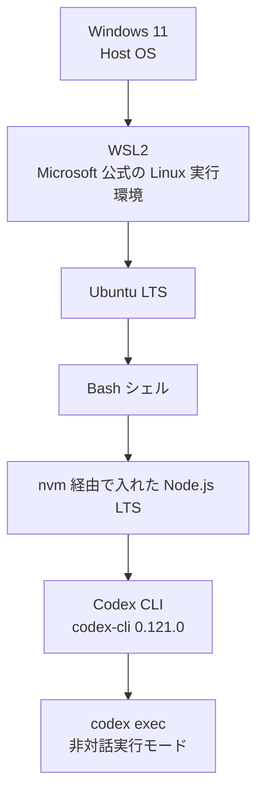
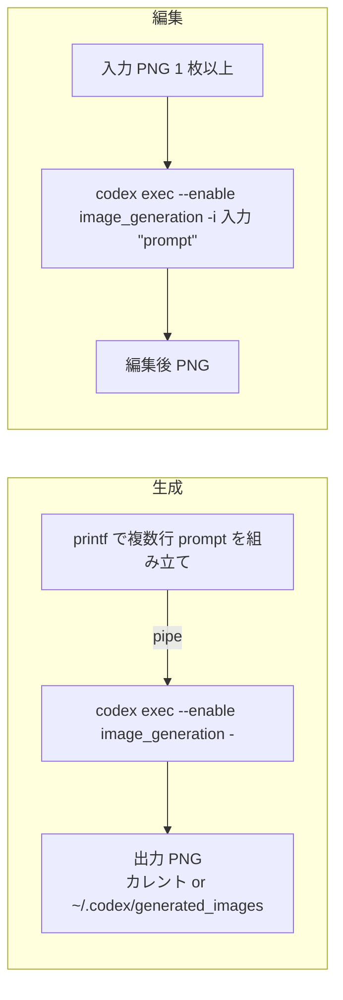
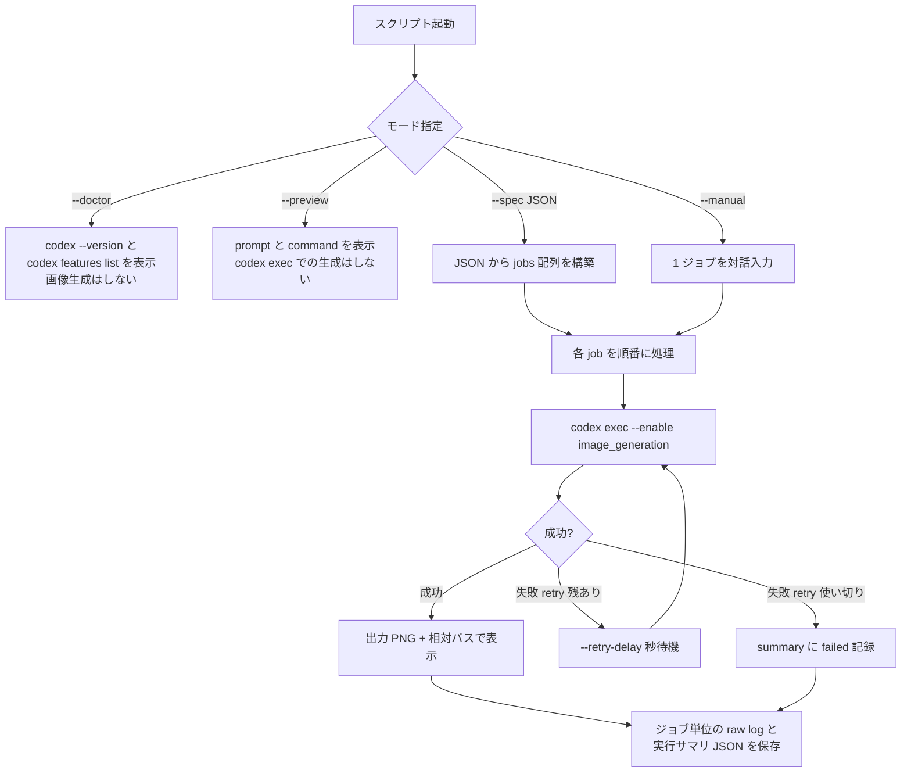

# WSL2 Ubuntu から Codex CLI で画像生成を試した個人メモ（2026-04-18 時点）

私（TK2LAB）が Codex と一緒に「Windows 11 の WSL2 Ubuntu + Bash 上で
`codex` を叩いて、画像生成や画像編集が本当にそのまま通るのか」を確かめて
いたところ、実際に出力できたので、自分用に残していた覚書を、同じ疑問を
持つ方向けにそのまま公開したものです。

最小コマンドはどこまでシンプルに書けたのか、縦長・横長・1:1 は通ったのか、
1 枚から複数枚に増えるとどこで摩擦があったのか、`image_generation` は
最初どう見えたのか、といった実地の検証結果を、動かした順に残しています。

> これは 2026-04-18 時点での、私一人 + Codex 分の検証結果の覚書です。
> 同じコマンドや手順を推奨しているわけではありません。Codex CLI は
> アップデートが早いため、今後のリリース、仕様変更、公式発表、新しい
> 発見などで、ここに書いた内容が変わったり、不備や誤解が見つかったり
> する可能性は十分にあります。**この時点の 1 つの参考情報** として
> ご利用ください。私のほうに質問や差分情報をお寄せいただいても、
> タイムリーに対応できないことが多いため、内容の最新性はご自身で
> 確認いただきつつ、より良いコマンドの書き方や運用方法を自由に
> 探していただけるのが、この共有の本来の意図です。

**検証日:** 2026-04-18
**検証者:** TK2LAB, Codex（CLI 側）
**ホスト OS:** Windows 11
**ランタイム:** WSL2 上の Ubuntu
**シェル:** Bash（Windows PowerShell ネイティブ実行は対象外）
**Codex CLI:** `codex-cli 0.121.0`
（その他のパッケージ／ランタイム／ライブラリの個別バージョンと
確認コマンドは、次の「[検証環境のバージョンと確認コマンド](#検証環境のバージョンと確認コマンド)」節にまとめています。）

---

## 目次

1. [はじめに（最低限の前提だけ）](#はじめに最低限の前提だけ)
2. [30 秒でわかる結論](#30-秒でわかる結論)
3. [環境と処理の全体像（図解）](#環境と処理の全体像図解)
4. [検証環境のバージョンと確認コマンド](#検証環境のバージョンと確認コマンド)
5. [検証スコープと断定していないこと](#検証スコープと断定していないこと)
6. [`image_generation` は既定で無効だったので、私が試した 2 通り](#image_generation-は既定で無効だったので私が試した-2-通り)
7. [最小コマンドでの動作確認結果](#最小コマンドでの動作確認結果)
8. [`printf` を使った理由と読み方](#printf-を使った理由と読み方)
9. [日本語 prompt と英語 prompt](#日本語-prompt-と英語-prompt)
10. [アスペクト比で見えた現実](#アスペクト比で見えた現実)
11. [1 枚から複数枚へ — 試しに作ってみた一括実行スクリプトの位置づけ](#1-枚から複数枚へ--試しに作ってみた一括実行スクリプトの位置づけ)
12. [今回辿った doctor → preview → run の順](#今回辿った-doctor--preview--run-の順)
13. [JSON spec の形](#json-spec-の形)
14. [組み込みプリセット](#組み込みプリセット)
15. [よく流れてくる話と、今回の検証結果との対比](#よく流れてくる話と今回の検証結果との対比)
16. [外部に共有する前の自分向けチェック](#外部に共有する前の自分向けチェック)
17. [オプション早見表](#オプション早見表)
18. [私の凡ミスも共有します](#私の凡ミスも共有します)
19. [はじめての方への補足](#はじめての方への補足)
20. [参照した公式ドキュメント](#参照した公式ドキュメント)

---

## はじめに（最低限の前提だけ）

この文書は、Codex CLI と WSL2 に最低限の知識がある読者が、私が試した
結果を追試できるよう整えたメモです。初心者向けの導入解説ではないので、
個々のツールの入門情報は各公式ドキュメントを優先してください（本文の
末尾近くに「[はじめての方への補足](#はじめての方への補足)」も置いてあり
ますので、CLI やシェルの操作にまだ慣れていない場合は先にそちらを
ご覧ください）。

- **Codex CLI** — OpenAI が提供するコマンドラインツール。本文のコマンドは
  `codex exec` を中心に扱います。
  公式: https://developers.openai.com/codex/cli
- **WSL2** — Windows の上で Linux を動かす Microsoft の公式機能。今回の
  検証は WSL2 上の Ubuntu + Bash で行いました。
  公式: https://learn.microsoft.com/windows/wsl/install
- **PowerShell と Bash は別物** — エスケープやパイプの扱いが異なります。
  本文のコマンドは WSL 側の Bash 前提です。PowerShell ネイティブ実行は
  検証していません。
- **コードブロックの読み方** — 先頭に `$` やプロンプト記号は付けていま
  せん。そのままコピーしてターミナルに貼り付けられる形に揃えています。
- **前提状態** — `codex` が WSL2 Ubuntu にインストールされており、初回の
  ログインと sandbox 設定が済んでいる状態を起点にしています。
- **副作用の大きさ** — 本文のコマンドは、副作用が小さいものから順に
  並べています。`--doctor` は診断のために `codex --version` と
  `codex features list` を呼びますが、画像生成は行いません。
  `--preview` も、最終 prompt と実行予定のコマンドを表示するだけで
  画像は生成しません。どちらも読取り専用の確認用途です。

以降の記述は、この前提の上で私が実際に実行したコマンドと、その結果を
並べた記録です。同じ結果が出るかどうかを、お手元でご確認いただけると、
このメモの意味が強くなります。

## 30 秒でわかる結論

まず結論だけ先にまとめます。詳細は各節で述べます。

- WSL2 Ubuntu の Bash から `codex exec` で、画像生成と画像編集の両方が
  通った。
- 最小の生成コマンドは `printf ... | codex exec -` の 1 行。
- 編集は `codex exec -i ./input.png "..."` の 1 行。2 枚同時に渡したい
  ときは `-i` を 2 つ並べる。
- 日本語 prompt・英語 prompt とも、生成・編集の両方で通った。
- 出力サイズは `1024x1024`, `1024x1536`, `1536x1024` の 3 実寸で安定した。
  任意比率は「希望値」として受け取られ、近い実寸に寄る挙動を何度か
  確認できた。
- 1 枚から複数枚に増えた時点で、preview・retry・path 正規化・サマリ生成を
  まとめて扱える小さなスクリプトを用意しておくと、作業がぐっと
  楽になった。
- Codex CLI の公式ドキュメントは、CLI 自体での画像生成・編集をサポート
  していると明記している（[参照](#参照した公式ドキュメント)）。

## 環境と処理の全体像（図解）

文章だけだと関係が把握しづらいので、今回の検証の構造を図にしました。
GitHub 上では Mermaid 図がそのまま描画されます。

**検証したスタック（上から下へ重なっている）**



**生成と編集の最小コマンドフロー**



**同梱スクリプト `codex-image-batch.sh` の大まかな流れ**



図はあくまで今回のスクリプトと検証の流れをまとめたもので、Codex CLI
本体の内部仕様を表すものではありません。

## 検証環境のバージョンと確認コマンド

「手元と違うから参考にならない」で終わらないよう、検証時に確認した
バージョンと、同じ値を取得するコマンドを一覧にします。左列の値は今回の
実測値、右列のコマンドはそのまま手元で走らせられます。値が確認できた
ものはそのまま掲載し、報告時点で未採取のものは `—` としています。
差分を見比べながら読み進めてください。

| 項目 | 今回の実測値 | 確認コマンド |
| --- | --- | --- |
| Windows | Windows 11 | PowerShell: `winver`、または `Get-ComputerInfo \| Select-Object WindowsProductName, WindowsVersion, OsBuildNumber` |
| PowerShell | — | PowerShell: `$PSVersionTable.PSVersion` |
| WSL | WSL2 | PowerShell: `wsl --version`、または `wsl --status` |
| Ubuntu ディストリビューション | Ubuntu（LTS） | Bash: `cat /etc/os-release`、または `lsb_release -a` |
| カーネル | — | Bash: `uname -r` |
| Bash | — | Bash: `bash --version` |
| Codex CLI | `codex-cli 0.121.0` | Bash: `codex --version` |
| Codex feature 状態 | `image_generation` が有効 | Bash: `codex features list` |
| Node.js | — （nvm 経由で LTS） | Bash: `node --version` |
| npm | — | Bash: `npm --version` |
| nvm | — | Bash: `nvm --version` |
| jq | — | Bash: `jq --version` |
| python3 | — | Bash: `python3 --version` |
| bubblewrap | — | Bash: `bwrap --version` |

まとめて記録したい場合は、WSL 側の Bash で次の 1 行を実行するとコピー
しやすい形で出力されます。

```bash
{
  printf '# Environment snapshot (%s)\n' "$(date -Iseconds)"
  echo "## From PowerShell, run separately:"
  echo "  winver ; Get-ComputerInfo | Select-Object WindowsProductName, WindowsVersion, OsBuildNumber ; \$PSVersionTable.PSVersion ; wsl --version"
  echo
  echo "## WSL / Bash"
  printf 'uname -a: %s\n' "$(uname -a)"
  printf 'bash: %s\n' "$BASH_VERSION"
  cat /etc/os-release 2>/dev/null | grep -E '^(NAME|VERSION)='
  printf 'codex: %s\n' "$(codex --version 2>/dev/null || echo 'not found')"
  printf 'node: %s\n' "$(node --version 2>/dev/null || echo 'not found')"
  printf 'npm: %s\n' "$(npm --version 2>/dev/null || echo 'not found')"
  printf 'jq: %s\n' "$(jq --version 2>/dev/null || echo 'not found')"
  printf 'python3: %s\n' "$(python3 --version 2>/dev/null || echo 'not found')"
  printf 'bwrap: %s\n' "$(bwrap --version 2>/dev/null || echo 'not found')"
}
```

PowerShell のバージョンと Windows のビルド番号は WSL からは直接取れない
ので、Windows 側で次の 2 行を別途実行してください。

```powershell
Get-ComputerInfo | Select-Object WindowsProductName, WindowsVersion, OsBuildNumber
$PSVersionTable.PSVersion
```

## 検証スコープと断定していないこと

検証の対象は上の環境に絞っています。そこから外れる領域については、
この文書では事実として述べず、読者自身の環境で改めてお確かめ
いただけるよう、断定していない点を明示します。

- 実寸 `1024x1024`, `1024x1536`, `1536x1024` の 3 サイズで安定動作を
  確認した。
- `codex exec` は、stdin から prompt を受ける形と、引数文字列として
  渡す形のどちらでも動作した。
- 生成物の保存先として、カレントディレクトリへのコピーと
  `~/.codex/generated_images` への保存の両方を確認した。
- text 側のモデル flow としては GPT-5.4 系を確認した。ただし、CLI が
  各呼び出しで内部的にどの image model alias を選んでいたかは、こちら
  から直接は確認できなかった。
- 公開できない内部固有名（キャラクター名、マシン名、ホームディレクトリ、
  私用メールなど）は、このリポジトリから意識的に外している。

断定していないこと:

- CLI が個々の呼び出しで採用していた image model alias の具体名。
- GPT-5.4 より前のモデル世代での同等挙動。
- 任意サイズ指定（例: `1408x768`）がモデル側で字義どおりに反映されること。
- Windows PowerShell ネイティブでの同等挙動。

## `image_generation` は既定で無効だったので、私が試した 2 通り

インストール直後の私の環境では、`codex features list` の出力で
`image_generation` が無効側（`false`）に表示されていました。これは
私の環境でそう見えたという範囲の話で、公式の初期値として断定できる
ものではありません。

> **補足（2026-04-19 時点の裏取り）**: OpenAI の公式 Codex ドキュメント
> で列挙されている feature 一覧（[Features – Codex CLI](https://developers.openai.com/codex/cli/features)
> および [Config basics](https://developers.openai.com/codex/config-basic)）
> には、本文執筆時点で `image_generation` という feature 名は載って
> いませんでした。一方で OpenAI の画像生成ツールガイド
> ([Image generation tool guide](https://developers.openai.com/api/docs/guides/tools-image-generation))
> には、画像生成は Codex の built-in `image_gen` ツールとして既定で
> 利用できる旨が書かれています。したがって、読者の環境では
> **`--enable image_generation` フラグを付けずに prompt を送っても、
> そのまま画像が生成されるかもしれません**。まずはフラグ無しで試し、
> 必要になったら以下の 2 通りをお試しください。
>
> また、私が検証した 2 通り（フラグ / `config.toml`）以外に、
> [Features – Codex CLI](https://developers.openai.com/codex/cli/features)
> には `codex features enable <feature>` / `codex features disable <feature>` /
> `codex features list` という公式サブコマンドがあると記載されています。
> feature 名として `image_generation` が受け付けられるかは、お手元で
> `codex features list` の出力にその名前が現れるかをご確認ください。

以下は、私の環境で実際に動作を確認できた方法です。どちらでも生成は
走り、縦長・横長・1:1 のいずれも出力できました。

**方法 A: `codex exec` の実行時に `--enable image_generation` を付ける**

```bash
codex exec --enable image_generation -
```

[Codex CLI reference](https://developers.openai.com/codex/cli/reference) に
よれば、`--enable` はグローバルフラグで、渡した値は内部的に
`-c features.<name>=true` と等価に設定されます。私の環境では、このフラグ
を付けた時に画像生成が通りました。同梱のスクリプト
`codex-image-batch.sh` も、`codex features list` で feature が無効と
表示されるときだけ、内部でこのフラグを付けるようにしています。

**方法 B: `~/.codex/config.toml` に設定を書く**

```toml
[features]
image_generation = true
```

この 2 行を書き加えると、私の環境では対話起動の `codex` でも
`codex exec` でも、フラグなしで画像生成が通りました。毎回フラグを
書くのが煩わしいときは、こちらが扱いやすく感じました。`config.toml` の
構造は [Config basics](https://developers.openai.com/codex/config-basic)
を参照してください。

新しい CLI バージョンでは既定値や有効化の手順が変わる可能性があります。
別のバージョンで試す場合は、まず `codex features list` の表示と、
上記の公式ドキュメントをご確認いただくのが確実です。

## 最小コマンドでの動作確認結果

最初に確認したかったのは「私の環境で、1 行のコマンドで生成・編集が通る
のか」でした。実際に通った最小コマンドを、生成 → 編集（1 枚）→ 編集（2 枚）
の順に記録します。同じコマンドをお手元で走らせて、結果を見比べて
いただけると、このメモの意味がはっきりします。

以下では、まだ `image_generation` を有効化していない前提で
`--enable image_generation` を明示しています。方法 B（`config.toml`）で
既に有効化している場合は、このフラグは省略できました。

**生成:**

```bash
printf 'Use the built-in image generation capability only.\nGenerate a square 1:1 image of a blue sphere on a white background.\nNo text, no logo, no watermark.\n' | codex exec --enable image_generation -
```

**1 枚の画像を編集:**

```bash
codex exec --enable image_generation -i ./input.png "Use the built-in image editing capability only. Change the background to white. Keep the subject, composition, and colors intact. No text, no logo, no watermark."
```

**2 枚の画像を組み合わせて編集（1 枚目を base、2 枚目を reference として扱わせたい場合）:**

```bash
codex exec --enable image_generation -i ./base.png -i ./reference.png "Use the first image as the base. Transfer the palette and mood from the second image while preserving the composition and main subject of the first image. No text, no logo, no watermark."
```

> 補足: [Codex CLI reference](https://developers.openai.com/codex/cli/reference) の
> `-i` / `--image` の説明は "Attach images to the first message.
> Repeatable; supports comma-separated lists." で、**複数の `-i` を
> 並べたときにどちらが base でどちらが reference になるか、という
> 順序の意味論はドキュメント上は定義されていません**。上のコマンドで
> そう動いているのは、prompt 側で明示的に "Use the first image as the
> base. … palette and mood from the second image …" と指示しているから
> であり、CLI 仕様ではなく prompt 側の指示に従わせた結果です。

実行前の様子見として、私はまず次の 2 行を打ちました。どちらも画像を
生成しないので副作用の心配はありません。

```bash
codex --version
codex features list
```

私の環境では `codex --version` が `codex-cli 0.121.0` を返し、
`codex features list` の `image_generation` は最初 `false` 側で
表示されていました。上の 3 つのコマンドで `--enable image_generation`
を付けているのはこのためです。

## `printf` を使った理由と読み方

one-liner の冒頭に `echo` ではなく `printf` を置いたのには、地味ですが
理由があります。

- `echo` は `\n` の扱いがシェル実装ごとにぶれる。`printf` は POSIX で
  挙動が定義されているため、改行入りの prompt を送るときに結果が揺れ
  にくい。
- `| codex exec -` の末尾 `-` は、`codex exec` 側で「prompt は stdin
  から読む」という明示的な指定。複数行のテキストを素朴に渡せる形に
  なる。

分解するとこのような構造です。

```bash
printf 'line1\nline2\nline3\n' | codex exec -
#  ^^^^^^                      ^     ^^^^^^^^^^
#  改行を含めて複数行を         パイプ  stdin から prompt を読む実行モード
#  標準出力に書き出す
```

`-i ./input.png` を付けない形（上の生成例）は「添付画像なしで生成」、
付けた形は「添付画像を読み込んで編集」という具合に、`-i` の有無だけで
そのまま挙動が切り替わります。

複数行をそのままの形で書きたいときは、heredoc を使っても同じ挙動に
なります。

```bash
codex exec - <<'EOS'
Use the built-in image generation capability only.
Generate a square 1:1 image of a blue sphere on a white background.
No text, no logo, no watermark.
EOS
```

ヒアドキュメントの境界記号を `'EOS'` のようにシングルクォートで囲むと、
bash が prompt 本文の `$` や `!` を展開しなくなります。prompt に `$`
を含めるときは、この形にしておくと安全です。

## 日本語 prompt と英語 prompt

今回は生成・編集の両方で、日本語・英語の prompt がどちらも通りました。
組み合わせは 4 通りです。

- 生成 × 日本語
- 生成 × 英語
- 編集 × 日本語
- 編集 × 英語

日本語の生成 prompt を手入力する場合の例:

```bash
printf 'built-in の画像生成機能だけを使ってください。\n正方形 1:1、1024x1024 で、白背景に青い球体を 1 枚描いてください。\n文字、ロゴ、透かしは入れないでください。\n' | codex exec -
```

日本語での編集指示の例:

```bash
codex exec -i ./input.png "built-in の画像編集機能だけを使ってください。背景だけを白に変更し、被写体、構図、色味は維持してください。文字、ロゴ、透かしは加えないでください。"
```

試した範囲で 2 つ、気づいた運用のコツを書き残しておきます。必須ではあり
ませんが、自分の手元では安定に寄与した表現です。

- 「built-in の画像生成機能だけを使ってください」と最初に宣言する。
  これを入れないと、状況によっては SVG や HTML で代用した応答に揺れる
  ことがあった。
- 「文字、ロゴ、透かしは入れないでください」をテンプレの末尾に固定で
  入れる。後で消すより、最初から入れておくほうが手戻りが少なかった。

## アスペクト比で見えた現実

今回の検証で試したかぎり、実際に出力されたサイズは次の 3 つでした。

- `1024x1024` — 正方形
- `1024x1536` — 縦長
- `1536x1024` — 横長

これは OpenAI の画像モデルの公開ドキュメントに記載されているサイズと
一致します（[参照](#参照した公式ドキュメント)）。

「9:16 の Instagram Story」「4:5 の Instagram フィード」「16:9 のヒーロー
バナー」といったよくある希望比率は、モデル側で最終的にこれら 3 実寸の
いずれかに寄る様子でした。同梱スクリプトの aspect preset も、その結果を前提に
次の対応で内部を組んでいます（`--list-presets` で同じ内容を表示できます）。

| preset            | 実寸の扱い                                         |
| ----------------- | -------------------------------------------------- |
| `square`          | 1024x1024                                          |
| `portrait`        | 1024x1536                                          |
| `landscape`       | 1536x1024                                          |
| `instagram_story` | 縦長（1024x1536 寄り）として扱った                 |
| `instagram_post`  | 縦長として扱った                                   |
| `hero_banner`     | 横長（1536x1024 寄り）として扱った                 |
| `custom`          | `1408x768` のような任意の `WIDTHxHEIGHT`           |

`custom` はモデル側で字義どおりに反映される保証のない「希望値」です。
近い公開サイズに寄ることを前提に書くほうが、あとで混乱しにくい、という
のが今回の感触です。

## 1 枚から複数枚へ — 試しに作ってみた一括実行スクリプトの位置づけ

1 枚の動作確認が取れたあと、複数枚をまとめて流したくなりました。
コマンドで 1 件ずつ prompt や `-i` 指定を書いていくのは手数が多くて
面倒そうだったので、**「JSON で管理できたら楽そうだから、試しに
作ってみよう」** くらいの動機で、小さな Bash スクリプトを書きました。
それが同梱の `codex-image-batch.sh` です。

**ツールとして配布しているつもりはありません。** 参考になりそうなら
お使いください、くらいの位置づけです。同じニーズを満たすためのより
洗練された方法（Make / Taskfile、Python スクリプト、並列実行、既存の
CI 系ツール等）はいくらでもあるので、ご自身の作業に合うものを自由に
選んでください。私のスクリプトは、参考 / アンチパターンのどちらと
しても使っていただいて構いません。

私の場合、結果的に次の 7 つの小さな便利機能があると、複数枚を回す
ときに手が止まらずに済みました。

- 本実行前に prompt と command を目視確認する（preview モード）
- 失敗したジョブを自動で retry する
- ジョブ間で一定秒数待つ
- Linux パス / Windows ドライブパス / WSL UNC パスの混在を正規化する
- Codex が PNG を指定先にコピーしなかった場合に
  `~/.codex/generated_images` から回収を試みる
- 1 回の実行の成否と出力パスを summary JSON に残す
- ジョブ単位の生ログを残す

外部依存は `jq` と `python3` のみ、本体は 1 ファイル完結で、読み切れる
長さに収めています。

## 今回辿った doctor → preview → run の順

私がスクリプトを使って動作確認したときの順序をそのまま残します。
「こう使ってください」ではなく「私はこう試しました」という記録です。

```bash
bash ./codex-image-batch.sh --doctor
```

`--doctor` は、`jq` や `python3` などの必要コマンド、`codex` の `PATH`、
`~/.nvm/.../bin/codex` のような fallback 候補、そして `image_generation`
feature の状態までをまとめて表示します。

`codex` が `PATH` に乗っていない環境では、実体を明示して同じ診断を
走らせられます。

```bash
CODEX_BIN="$HOME/.nvm/versions/node/<your-version>/bin/codex" \
  bash ./codex-image-batch.sh --doctor
```

`<your-version>` は、手元でインストールされている Node のバージョンに
置き換えてください。

```bash
bash ./codex-image-batch.sh --spec ./examples/codex-image-batch.sample.json --preview
```

`--preview` は、最終 prompt と実行予定の `codex exec` コマンドを表示
するだけで、Codex 本体は呼び出しません。

```bash
bash ./codex-image-batch.sh --spec ./examples/codex-image-batch.sample.json --pause-at-end
```

本実行の前に確認プロンプトが入ります。自動化したいときだけ `--no-prompt`
を明示します。

JSON を用意せず、対話で 1 ジョブだけ走らせたいときは manual モードが
便利でした。

```bash
bash ./codex-image-batch.sh --manual --pause-at-end
```

## JSON spec の形

スクリプトは、spec の root を 3 つの形で受け付けます。

- 単一ジョブの object
- ジョブ配列
- `defaults` と `jobs` を持つ object

後から option を追加するとき、3 つ目の形がいちばん扱いやすく感じました。

```json
{
  "defaults": {
    "language": "ja",
    "codex_model": "gpt-5.4",
    "output_dir": "./outputs"
  },
  "jobs": [
    {
      "name": "my-first-image",
      "mode": "generate",
      "aspect_ratio": "square",
      "prompt": "A clean product photo of a glass bottle on a white background."
    }
  ]
}
```

気をつけた点:

- `codex_model` は `codex exec --model` にそのまま渡される override で、
  スクリプト側では値の妥当性を検査していません。どのモデル名が受け入れ
  られるかは、そのときの Codex CLI とアカウントの挙動に依存します。
- 相対パスは、シェルの cwd ではなく **spec ファイル自身の場所** を
  基準に解決されます。spec を含むフォルダを移動しても壊れない形にした
  かったため、この動作を選びました。
- `mode` は `generate` または `edit`。`edit` の場合は `input_image`
  または `input_images` を少なくとも 1 つ指定します。
- `subject` と `scene` に分けて書くと、スクリプトが style・aspect と
  組み合わせて prompt を構築します。prompt を 1 本の文字列で書きたい
  ときは `prompt` フィールドを使うと、そちらが優先されます。

サンプルは 2 本同梱しています。

- `examples/codex-image-batch.sample.json` — 生成系 5 ジョブ
- `examples/codex-image-edit-batch.sample.json` — 編集系 3 ジョブ

## 組み込みプリセット

アスペクト preset は上の「アスペクト比で見えた現実」のとおり。スタイル
preset は意図的に少なく、今回の実験に必要だったものだけに絞っています。

- `none`
- `watercolor`
- `cinematic`
- `pixel_art`
- `product_render`

最新の一覧は `--list-presets` で取得できます。

## よく流れてくる話と、今回の検証結果との対比

ネットや会話で繰り返し耳にする話を、今回の環境で試した結果と公式
ドキュメントの記述に照らして並べます。あくまで今回のセットアップで
見えた範囲の話です。別の環境で別の結果が出た場合には、そちらの
検証結果の方が優先されます。

**「画像生成は Codex desktop app でしかできないのでは？」**

今回の検証ではそう思えませんでした。Codex CLI の公式ドキュメントでは、
CLI 自体で画像生成と画像編集の両方がサポートされていると明記されて
います（[参照](#参照した公式ドキュメント)）。今回の検証も CLI だけで
完結しました。

**「GPT-5.4 と表示されているなら、GPT-5.4 本体が PNG を描いているはず」**

そこまでは言えませんでした。今回確認できたのは、CLI の text 側で
GPT-5.4 系が使われていたこと、そして画像は Codex の built-in image
generation を経由して出ていたことまでです。OpenAI の発表では
Codex が `gpt-image-1.5` を使うと案内されていますが、CLI 上で内部の
image model alias までは表面に出ていませんでした。

**「OpenAI の API を直接叩かないと画像生成は無理では？」**

そうではありませんでした。API は便利ですが、今回のサンプルの範囲では
CLI 単体で完結できました。API ドキュメントは、モデル側が実際に対応する
画像サイズの裏取りとして活用しました。

**「任意サイズを指定すれば、字義どおりに返ってくるのでは？」**

今回の検証ではそうなりませんでした。実運用で安定したのは公開 3 実寸
（`1024x1024`, `1024x1536`, `1536x1024`）でした。任意比率は「希望値」と
捉えた方が、結果との食い違いが小さくなりました。

**「WSL の前提なんて、気にしなくていいのでは？」**

Codex の sandbox ドキュメントは、Linux / WSL2 の前提として
`bubblewrap` を挙げています。環境が整っているほうが失敗の原因切り分け
が短くなったので、今回はその案内に沿って進めました。

**「GPT-5.4 以前のモデルでも、同じように動くのでは？」**

この文書ではそれを証明していません。ここに書いたのは `codex-cli 0.121.0`
と GPT-5.4 世代での検証に限定されています。

## 外部に共有する前の自分向けチェック

今回のような実験ノートをほかの人に渡すとき、自分に対して毎回通して
いるチェックを共有しておきます。読者自身の文脈でも、同じ観点が役立つ
ことがあるかもしれません。

- 個人のホームディレクトリ絶対パスが、prompt / log / summary に残って
  いないか。スクリプトは可能な範囲で相対パスに丸めて書き出すが、
  prompt や入力画像名までは手で整えた方が確実だった。
- 固有のキャラクター名やプロダクト名が残っていないか。サンプル prompt は
  glass bottle や blue sphere のような汎用被写体に差し替えた。
- ホスト名、Windows ユーザー名、私用メールアドレス、API キー、トークン、
  Node の固定バージョン文字列などが、環境メモに紛れていないか。
- 出力フォルダに、そのまま共有するのはためらう画像が残っていないか。
  `.gitignore` は `examples/outputs/`, `examples/edited-outputs/`,
  `*.log.txt`, 実行サマリ JSON などを除外してあるが、手元の追加出力先
  については都度確認している。

## オプション早見表

- `--spec PATH` — JSON spec ファイルのパス
- `--output-root PATH` — 出力ルートの上書き
- `--codex-bin PATH` — codex 実体を明示（環境変数 `CODEX_BIN` でも可）
- `--ui-mode auto|cli` — 入力モードの選択（デフォルト `auto`）
- `--manual` — JSON を使わず手入力で 1 ジョブ
- `--preview` — prompt と command を表示するだけで実行はしない
- `--doctor` — 環境診断のみ実行
- `--list-presets` — 組み込み preset を一覧表示
- `--no-prompt` — 確認プロンプトを出さずに進める（`--spec` か `--manual`
  が必須）
- `--stop-on-job-error` — 1 件失敗で停止
- `--overwrite` — 既存出力を上書き
- `--pause-at-end` — 実行後に Enter 待ち
- `--inter-job-delay N` — ジョブ間で `N` 秒待機（デフォルト 2）
- `--generated-image-wait N` — `~/.codex/generated_images` からの回収
  待機（デフォルト 5 秒）
- `--retry-count N` — 失敗時の **追加** 再試行回数（デフォルト `1`。
  つまり最初の 1 回 + 再試行 1 回 = 最大 2 回試行）
- `--retry-delay N` — 再試行の間隔秒数（デフォルト 3）
- `-h`, `--help` — ヘルプ表示

## 私の凡ミスも共有します

ここでは、私が作業中にやってしまった初歩的なミス・凡ミスも、失敗事例
として並べます。すでに CLI 作業に慣れたエンジニアの方にとっては当たり
前すぎて役に立たない内容かもしれませんが、初心者の方や、CLI や WSL に
少し触れ始めたばかりの方にとっては、同じ道を踏まないためのヒントに
なる可能性があると思っています。

- スクリプトを WSL ではなく Windows PowerShell で走らせてしまう。
  このパッケージは WSL の Bash 前提で作った。
- JSON ファイルの代わりにフォルダのパスを貼ってしまう。スクリプトが警告を
  出す。
- 新しい spec を preview せずに本実行に回す。preview は副作用がゼロで、
  実行前の安価な安全装置として便利だった。
- edit mode で入力画像の指定を忘れる。edit ジョブは最低 1 枚必須。
- 既存の PNG が自動で上書きされると思い込む。デフォルトは skip。上書き
  したいときだけ `--overwrite` を付ける。
- `C:\...` や `\\wsl.localhost\...` は絶対に失敗すると思い込む。よくある
  形は自動で Linux パスに変換した。ただし `\\wsl.localhost\` と
  `\\wsl$\` 以外の UNC（例: `\\server\share\...`）は変換対象外です。

スクリプト寄りの注意点も 3 つだけ添えておきます（私の凡ミスではない
ですが、同じところで迷う方がいそうなので）:

- **1 ジョブが固まったときの抜け方** — スクリプトは `codex exec` に
  タイムアウトを設けていません。ネットワーク停止などで 1 ジョブが
  長時間ハングすると、バッチ全体が待ち続けます。その場合は `Ctrl-C`
  で抜けてから、問題の spec を切り分けてください。
- **同じ出力ディレクトリで並行実行しない** — 複数のスクリプト（または
  複数の `codex` 呼び出し）を同時に走らせると、fallback で
  `~/.codex/generated_images` から拾う際に他プロセスの PNG を拾う
  可能性があります。1 つずつ順に走らせるのが無難でした。
- **`raw log` ファイルには Codex の stdout/stderr がそのまま残る** —
  API エラー時にはパスやエラー断片が含まれることもあります。ログを
  他人に共有するときは、目視で一度ご確認ください。`.gitignore` では
  `*.log.txt` を除外しているのでコミット事故は防げます。

## はじめての方への補足

この節は、Codex CLI や Bash、WSL2 の操作にまだ慣れていない方向けに
設けた、ごく軽い補足です。専門家として網羅的に解説することが目的では
なく、「この文書を安全に読み進めるための最低限のポイント」をまとめた
ものです。

- **PowerShell と Bash は別もの** — Windows 側で最初に開く PowerShell と、
  WSL 内の Bash は、見た目は似ていますが文法や環境変数の扱いが違います。
  本文のコマンドは WSL 側の Bash（スタートメニューから Ubuntu を開いた
  状態）で実行する前提です。Windows PowerShell にそのまま貼り付けると
  文法エラーで止まることがあります。
- **WSL2** — Windows 上に仮想的な Linux を置く Microsoft 公式の仕組み
  です。Ubuntu 側の作業は Windows の通常利用にほとんど影響しません
  が、大事な作業中の PC で慣れないコマンドを試すのは避けていただく
  のが安心です。
- **環境変数（`$HOME`, `PATH` など）** — 「どのコマンドがどこを探しに
  いくか」を決める変数です。`export` を含むコマンドは、実行中のシェル
  の挙動を変える設定になります。意味がはっきりしない `export` 行は
  貼り付けないでください。
- **`sudo` を含むコマンド** — 管理者権限での実行です。`sudo apt
  install ...` は Linux の標準的なパッケージ導入コマンドですが、
  意味が分からない `sudo` コマンドは実行を保留してください。
- **nvm** — Node.js を複数バージョン切り替えるためのツールです。
  インストールするとシェル起動時に自動で有効化される設定が入ります。
  `codex: command not found` のような表示が出た場合、新しいターミナル
  を開き直すと解決することが多いです。
- **`codex` の初回ログイン** — 最初の実行ではブラウザが開き、OpenAI
  アカウントでの認可画面に進みます。画面の指示どおり進めれば完了
  します。不安な場合は、認可を進める前に Codex CLI の公式ドキュメント
  を一読してから取り組んでください。
- **コマンドの副作用** — 本文のコマンドのうち、`--doctor` と
  `--preview` は Codex 本体を呼ばず画像も生成しません。まずこの 2 つで
  動作を確認してから本番実行に進む形が安全です。

CLI 操作に自信がないうちは、**周囲のエンジニアや詳しい方に声を掛けて、
一緒に画面を見ながら進めていただくのが一番安心** です。お一人で進めて
いる場合は、各ツールの公式ドキュメント（本文末尾に一覧）をあらかじめ
読み、1 行ずつ意味を確認しながらゆっくり進めてください。この文書は、
その過程を少し短くするための参考資料として置いてあります。

## 参照した公式ドキュメント

この文書の主張は、可能な限り一次情報に寄せて確認しています。異なる検証結果や
より新しい記述が見つかった場合は、そちらが優先されます。

- Codex CLI ドキュメント
  https://developers.openai.com/codex/cli
- Codex sandboxing と Linux/WSL 前提（`bubblewrap`）
  https://developers.openai.com/codex/concepts/sandboxing#prerequisites
- 画像生成ツール利用ガイド
  https://developers.openai.com/api/docs/guides/tools-image-generation
- OpenAI モデルカタログ
  https://developers.openai.com/api/docs/models/all
- GPT Image 1.5 のモデルページ
  https://developers.openai.com/api/docs/models/gpt-image-1.5/
- Codex for (almost) everything
  https://openai.com/index/codex-for-almost-everything/
